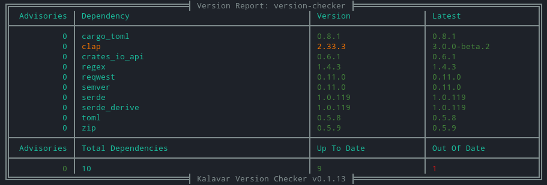
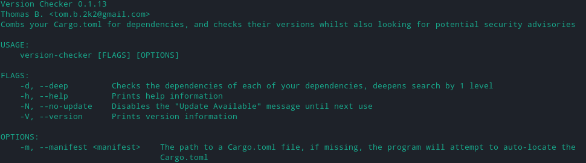
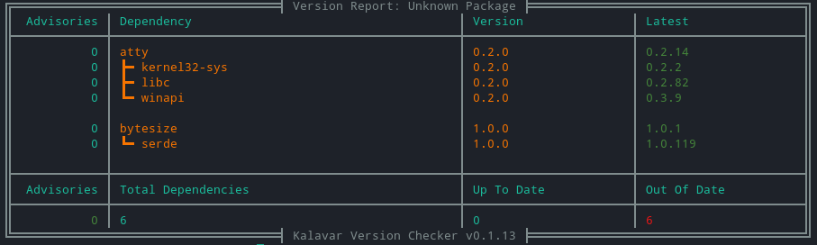

# Version Checker
A platform agnostic version checking utility for your cargo crates.

Reads your Cargo.toml and parses out the dependencies, processing their versions and comparing them to a list of known security advisories, as well as their most recent version on [crates.io](https://crates.io).


# Installation

```cargo install version-checker```


# Usage 
## Help
```
version-checker --help
```


## No Update
```
version-checker --no-update
```
Hides the "Update Available" message from being printed to the terminal.

## Manifest
```
version-checker --manifest ./path/to/Cargo.toml
```
Processes the indicated manifest file instead of trying to find the default one automatically.

## Deep mode
```
version-checker --deep
```
This mode makes the program check the immediate dependencies of your dependencies, to see if they have any security advisories, or if they have any updates available to them which you might need to take into account.

> #### Note:
> This mode will take longer to run based on how many dependencies you have for it to check.